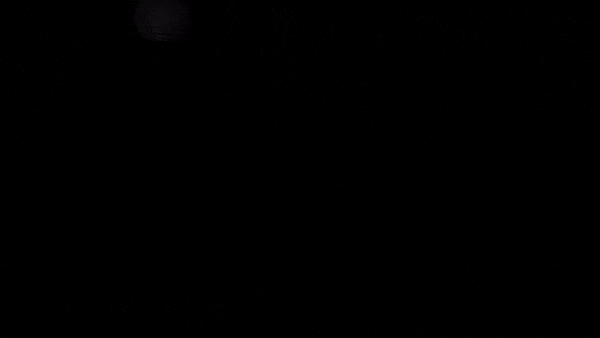

# True dark theme!

### CREDIT
Credit where credit is due. This is not my idea and not even my code. I found this on reddit and somehow to forget the link to that post
However, I did re-write it using Vue.js as the original was in plain HTML, CSS & JavaScript and did a few tweaks to it.

### Demo (Works better with Mouse, touch not supported, might have to double tap)
> https://pitchdark.now.sh



## Project setup
```
yarn install
```

### Compiles and hot-reloads for development
```
yarn serve
```

### Compiles and minifies for production
```
yarn build
```

### Customize configuration
See [Configuration Reference](https://cli.vuejs.org/config/).
